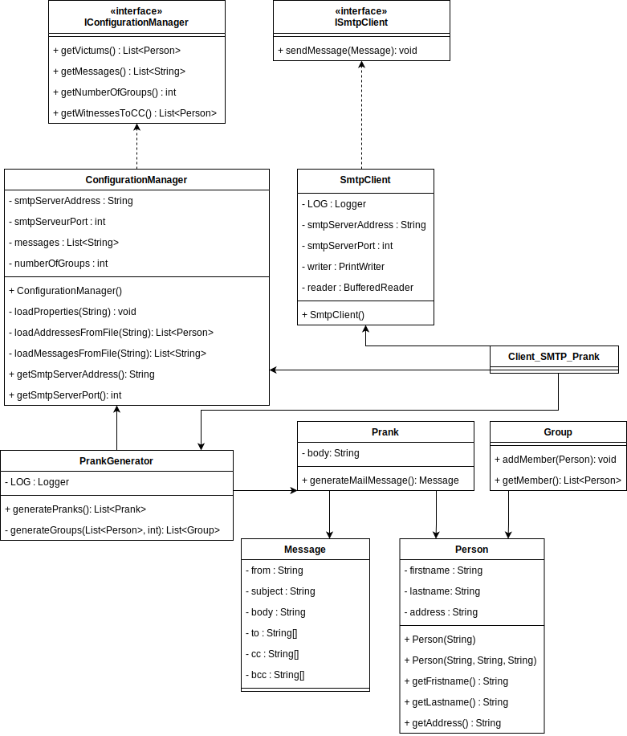
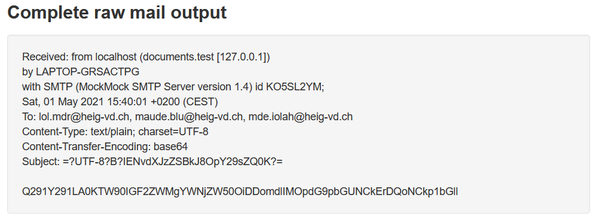
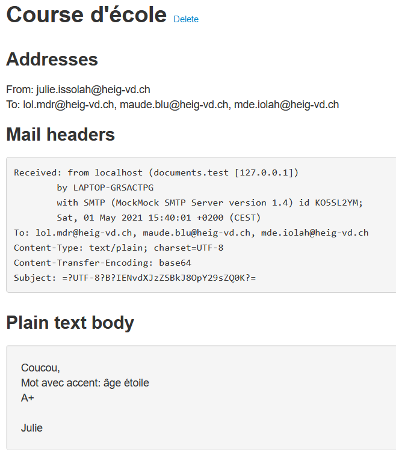
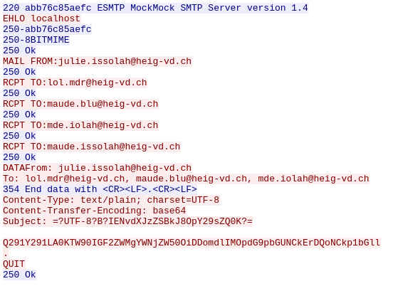

# Client_SMTP_Prank

Client de "prank" SMTP développé dans le cadre du cour réseau (RES) 2021 de la HEIG-VD.

Cette application java permet de créer et d'envoyer des mails forgés.


## SMTP mock serveur

Dans le but de tester l'application sans spammer le monde, il peut être utile d'utiliser un serveur SMTP de test. Un mock serveur imite le comportement d'un vrai serveur. 

Nous avons choisis d'utiliser application MockMock recommandée lors du cours (voir ci-dessous). Cette application peut être utilisée tel quel, à condition d'avoir java sur sa machine, mais selon la consigne du labo, nous l'avons utilisée depuis un container Docker.

Mise en place d'un serveur mock dans un container Docker.

- Téléchargement du fichier MockMock.jar depuis le lien du README du dépôt github: https://github.com/tweakers/MockMock

- Création d'un fichier dockerfile avec le contenu ci-dessous:

  ````bash
  FROM openjdk:11
  RUN mkdir /opt/smtpServer
  COPY MockMock.jar /opt/smtpServer
  
  # Webapp port
  EXPOSE 8282
  
  # SMTP port
  EXPOSE 25
  
  CMD ["java", "-jar", "/opt/smtpServer/MockMock.jar"]
  ````

  

- Création de l'image docker

  ````bash
  # Depuis le dossier qui contient le dockerfile
  docker build -t mockmock .
  ````

  

- Lancement du container

  ````bash
  docker run -p 8282:8282 -p 25:25 mockmock
  ````


Comme expliqué dans la documentation de MockMock, l'application web est disponible à `localhost:8282` par défaut, mais il est possible de spécifier un autre port (voir la doc de MockMock)


## Utilisation

### Fichiers de configurations

Trois fichiers de configuration sont nécessaire à l'application. Ces trois fichiers doivent se trouver dans un dossier nommé `config` qui sera placé à côté du fichier `.jar`.

- config.properties
- messages.utf-8
- victims.utf8


### Configuration de la connexion

Fichier `config/config.properties`

````bash
# Adresse du serveur SMTP
smtpServerAddress=localhost

# Port du serveur SMTP
smtpServerPort=25

# Nombre de groupes de personnes à créer
numberOfGroups=3

# Le/s témoin(s) du prank séparés par une virgule (Si un seul -> pas de virgule)
witnessesToCC=me@mail.com,other@mail.com
````


### Configuration des messages de prank

Fichier `config/messages.utf-8`

Les messages doivent commencer par la ligne `Subject: <sujet du mail>` qui défini le sujet du mail.

Les messages sont séparés par `==`

**Exemple**:

````bash
Subject: sujet1
Mon message
sur plusieurs lignes
==
Subject: sujet2
Mon message sur une ligne
````


### Configuration de la liste des "victimes"

Fichier `config/victims.utf8`

Ce fichier contient les adresses mail des "victimes" du prank, avec une adresse par ligne.

````bash
mail_1@mail.com
mail_2@mail.com
````


### Envoi des mails

Les commandes ci-dessous doivent être faites depuis le dossier `Client_SMTP_Prank`.

````bash
# Construction du fichier jar
mvn clean install

# Lancement de l'application (le dossier config doit se trouver au même endroit)
java -jar target/client_smtp_prank-1.0-SNAPSHOT.jar
````


## Implémentation

Notre implémentation suit quasi exactement celle proposée dans le cours.

Nous avons choisis d'envoyer les messages ainsi que les sujets encodé en Base64.


### UML



### Classes importantes

- **ConfigurationManager**

  Lit les fichiers de configurations, et en extrait les données.

- **PrankGenerator**

  Génère les groupes, et les pranks.

  Un prank défini 

  - les personnes impliquées (émetteur/récepteurs)
  - Le message envoyé

- **SmtpClient**

  Gère la connexion avec le serveur, et envoi les mails.


### Démo

- Donnée brutes reçues par le serveur MockMock.

  Nous pouvons voir que le contenu ainsi que le sujet sont bien encodé en base 64.




- Mail reçu par le serveur MockMock.

  Nous permet de vérifier que le contenu est bien décodé, et que les accent sont pris en compte correctement.




* Flux TCP vu par Wireshark

  Sur cette vue nous pouvons constater qu'il y a une personne en copie cachée.

  